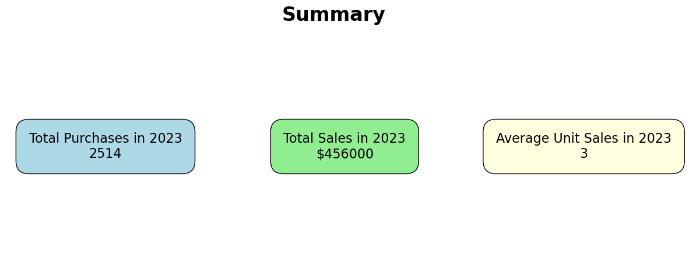
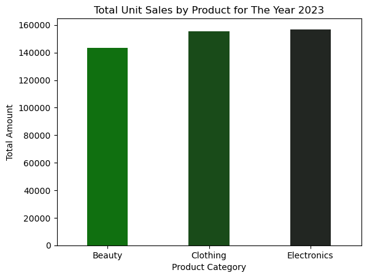
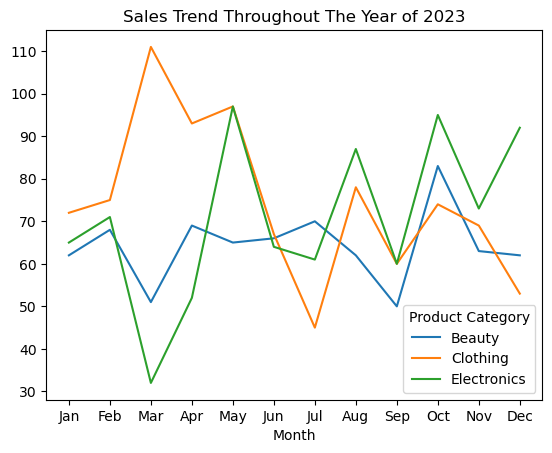

# Overview
I am currently conducting an analysis of a dataset from a retail company. The goal of this analysis is to delve deeper into the company's sales performance. More specifically, I aim to examine sales patterns based on gender and age, as well as to identify the most popular product categories within the retail store.

The dataset I am using is sourced from Kaggle.com. It contains information on products, gender, age, and transaction details. I will provide a more detailed explanation of my analysis methodology below.

## Research Questions
1. What was the total sales figure for 2023?

2. What was the total quantity of items purchased in 2023?

3. What is the average purchase quantity per customer in 2023?

4. Which product had the highest annual sales and how did its sales perform throughout the year?

5. What are the most frequently purchased items by male and female customers in the retail store?

6. Which items are purchased most frequently by each age group? 

## Tools Used
- Python: I will be utilizing the Python programming language with the Pandas library for exploratory data analysis (EDA) and Seaborn and Matplotlib for data visualization.
- Jupyter Notebook: This tool will be used to execute my code.
- Visual Studio Code: This tool will also be used to execute my code.
- Git & GitHub: These platforms will be used to share the findings of my analysis.
- ChatGPT : This platform serves as a cognitive supplement, enabling me to perform my tasks with greater efficacy and expediency.

# Data Preparation and Cleanup

This section outlines the steps taken to prepare the data for analysis, ensuring accuracy and usability.

## Import and Clean Data

At this step, I am importing the necessary Python libraries and dataset for this data analysis.

```python
# Importing Libraries
import pandas as pd
import seaborn as sns
import matplotlib.pyplot as plt

# Loading Dataset
dataset = "C:/Users/naufa/OneDrive/ドキュメント/Data Analysis/Dataset/archive (5)/retail_sales_dataset.csv"
df = pd.read_csv(dataset)

# Data Cleanup
df['Date'] = pd.to_datetime(df['Date'])

```

## Data Transformation

In this step, I added an age category column where I grouped individuals below 30 years old as the "young" group, those between 30 and 50 years old as the "adult" group, and those above 50 years old as the "older adult" group.

```python
# Adding an "age category" column
df['Age Category'] = pd.cut(df['Age'], 
                        bins=[0, 29, 50, float('inf')], 
                        labels=['Young', 'Adult', 'Older Adult'])

# Removing the 'Age Category' column and then reintroducing it at the preferred index.
df.insert(df.columns.get_loc('Age') + 1, 'Age Category', df.pop('Age Category'))

# To display results
df.head()

```

Subsequently, I will introduce new columns for month and day to enhance the precision of the analysis.

```python
# add new column 'Month' dan 'Day'
df['Month'] = df['Date'].dt.strftime('%b')
df['Day'] = df['Date'].dt.day

# Moving the 'Month' and 'Day' columns next to the 'Date' column.
df.insert(df.columns.get_loc('Date') + 1, 'Month', df.pop('Month'))
df.insert(df.columns.get_loc('Date') + 2, 'Day', df.pop('Day'))

# Establishing a categorical sequence of months, starting from January and ending in December
month_order = ['Jan', 'Feb', 'Mar', 'Apr', 'May', 'Jun', 'Jul', 'Aug', 'Sep', 'Oct', 'Nov', 'Dec']


# Converting the 'Month' column into a properly ordered category.
df['Month'] = pd.Categorical(df['Month'], categories=month_order, ordered=True)

```

# Analysis

In this phase, we will address all queries presented in the research question.

## What was The Total Sales, Total Quantity Purchased and Average Purchased?

To find this data, I need to sum all the values in the "total amount" and "quantity" columns, and then use the mean function in Pandas to calculate the average. After that, I will visualize the results in a card.

### Visualization

```python
#Creating a layout for multiple cards.
fig, ax = plt.subplots(1, 3, figsize=(15, 5))

# Card 1 - Total Quantity
total_quantity = df['Quantity'].sum()
ax[0].text(0.5, 0.5, f'Total Purchases in 2023\n{total_quantity}', fontsize=16, ha='center', va='center', bbox=dict(facecolor='lightblue', boxstyle='round,pad=1'))
ax[0].axis('off')

# Card 2 - Total Sales
total_sales = df['Total Amount'].sum()
ax[1].text(0.5, 0.5, f'Total Sales in 2023\n${total_sales}', fontsize=16, ha='center', va='center', bbox=dict(facecolor='lightgreen', boxstyle='round,pad=1'))
ax[1].axis('off')

# Card 3 - Average Quantity
average_quantity = df['Quantity'].mean()
ax[2].text(0.5, 0.5, f'Average Unit Sales in 2023\n{average_quantity:.0f}', fontsize=16, ha='center', va='center', bbox=dict(facecolor='lightyellow', boxstyle='round,pad=1'))
ax[2].axis('off')

plt.show()

```

### Result




### Insight

In 2013, a total of 2514 purchases were made, resulting in a revenue of $456.000. The average customer purchased 3 items annually.

## Which product had the highest annual sales and how did its sales perform throughout the year?

To find the total sales for each of the three product categories and analyze their monthly sales performance over a year, I used a pivot table to create a comprehensive summary

For a more comprehensive explanation of the steps involved, please access the link below:
[Retail_Data_Sales](Retail_Data_Sales.ipynb)

### Visualization (The Highest Annual Sales)

Here's my approach to visualizing data with Seaborn.

```python
sns.barplot(data=df_total, x='Product Category', y='Total Amount', hue='Product Category', width=0.4, palette='dark:g_r')
plt.title('Total Unit Sales by Product for The Year 2023')

```

### Result



### Visualization (Sales Performance Throughout The Year)

Here's my approach to visualizing data with Seaborn.

```python
sns.lineplot(data=df_pivot_1, dashes=False, legend='full', palette='tab10')
plt.title('Sales Trend Throughout The Year of 2023')

```

### Result



### Insights

- Of the three product categories, electronic goods contributed the most significantly to the company's revenue, followed by clothing and beauty products. Sales data for electronics exhibited notable peaks and troughs, with March recording both the highest and lowest sales figures. Clothing sales reached their zenith in May and their nadir in March, while beauty products achieved their peak in October and their lowest point in September.

- A more in-depth analysis indicates that beauty products offer a more consistent revenue stream compared to the other two categories. This consistency is attributable to the higher frequency and regularity of beauty product purchases. Consequently, even though electronics and clothing generate greater overall revenue, beauty products play a crucial role in stabilizing the company's income, particularly during periods when the sales of the other two categories are relatively weak. This can be attributed to the shorter product lifecycle of beauty items compared to electronics and clothing.

## What are the most frequently purchased items by male and female customers in the retail store?

To analyze purchasing patterns by gender over a year, I created a pivot table. The pivot table summarized the quantity of products purchased, with 'Gender' as the row label and 'Product Category' as the column label. All quantities were summed to provide a total purchase volume. Subsequently, I employed a heatmap visualization to represent this aggregated data. For a more comprehensive view, please refer to this link.
[Retail_Data_Sales](Retail_Data_Sales.ipynb)

### Visualization

Here's my approach to visualizing data with Seaborn.

```python
plt.figure(figsize=(10, 6))
sns.heatmap(df_pivot_2, annot=True, fmt='g', cmap='Greens')
plt.title('Gender and Product Segmentation of 2023 Purchases')

```
### Result


### Insights

- Both men and women purchased a significant amount of clothing over the year, with men purchasing a total of 453 clothing items and women purchasing 441.

- Women are the primary purchasers of beauty and electronic items.

## Which Items are Purchased Most Frequently by Each Age Group? 

After dividing the data into age categories, we can use a pivot table to analyze general purchasing patterns. For more detailed instructions, please refer to the following link. 
[Retail_Data_Sales](Retail_Data_Sales.ipynb)

### Visualization

Here's my approach to visualizing data with Seaborn.

```python
plt.figure(figsize=(10, 6))
sns.heatmap(df_pivot_3, annot=True, fmt='g', cmap='Greens')
plt.title('Age and Product Segmentation of 2023 Purchases')

```

### Result


### Insights

- Customers aged 30-50 (adults) made the most purchases at retail stores compared to younger and older age groups.

- The adult demographic is the primary consumer of clothing in retail environments.


# What I Learned

Throughout this project, I deepened my understanding of the sales at a retail company during the 2023 period and enhanced my technical skills in Python, especially in data manipulation and visualization. Here are a few specific things I learned:

- **Python Usage** : Using libraries like Pandas and Seaborn has greatly helped me analyze and visualize data more effectively and efficiently.

- **Data Cleaning Importance** : Data cleaning is crucial to ensure the accuracy of our data analysis.

- **Business Analysis** : This project has allowed me to gain a deeper understanding of sales within the retail company by analyzing data based on gender, age groups, and product category performance.

# Challenges I Faced

This project was not without its challenges. The challenge I'm facing now is finding the right visualization to represent the data. To effectively convey the findings, we need to choose a visualization that is easy for the reader to understand.

# Conclusion

Retail sales analysis offers a wealth of data that can be harnessed to drive business growth. By identifying high-performing products and customer segments, companies can make more strategic decisions to increase profitability. In 2024, management can use these insights to optimize product portfolios and target specific market segments to surpass the previous year's revenue.


